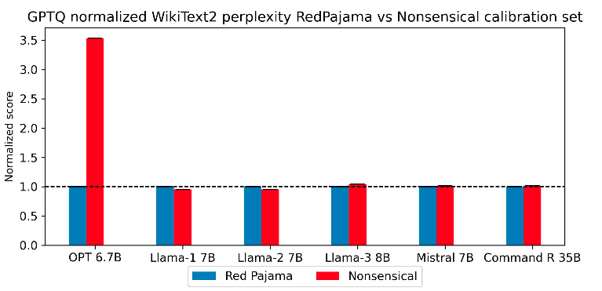

# Awesome-LLM-Quantization

  
  
  
  
  
 
   

Welcome to the Awesome-LLM-Quantization repository! This is a curated list of resources related to quantization techniques for Large Language Models (LLMs). Quantization is a crucial step in deploying LLMs on resource-constrained devices, such as mobile phones or edge devices, by reducing the model's size and computational requirements.

## Contents

This repository contains the following sections:

- **Papers**: A collection of research papers and articles on quantization techniques for LLMs.
- **Tutorials**: Step-by-step guides and tutorials for implementing quantization methods.
- **Libraries**: A list of open-source libraries and frameworks that support quantization for LLMs.
- **Datasets**: Datasets commonly used for benchmarking and evaluating quantized LLMs.
- **Tools**: Useful tools and utilities for quantization and deployment of LLMs.

## Papers 

| Title & Author & Link                                        | Introduction                                                 | Summary                                                      |
| ------------------------------------------------------------ | ------------------------------------------------------------ | ------------------------------------------------------------ |
| ICLR22  [GPTQ: Accurate Post-Training Quantization for Generative Pre-trained Transformers](https://arxiv.org/abs/2210.17323)   Elias Frantar, Saleh Ashkboos, Torsten Hoefler, Dan Alistarh   [Github](https://github.com/IST-DASLab/gptq) |  | This Paper is the first one to apply post-training quantization to GPT. GPTQ is a one-shot weight quantization method based on approximate second-order information(Hessian). The bit-width is reduced to 3-4 bits per weight. Extreme experiments on 2-bit and ternary quantization are also provided.  #PTQ #3-bit #4-bit #2-bit |
| ICML23 [SmoothQuant: Accurate and Efficient Post-Training Quantization for Large Language Models](https://arxiv.org/abs/2211.10438)   Guangxuan Xiao, Ji Lin, Mickael Seznec, Hao Wu, Julien Demouth, **Song Han**   [Github](https://github.com/mit-han-lab/smoothquant) |  | SmoothQuant is a post-training quantization framework targeting W8A8 (INT8). In General, weights are easier to quantize than activation. It propose to migrate the quantization difficulty from activations to weights using mathematically equivalent transformation using $`s = \frac{\left( \max \left( \lvert X \rvert \right) \right)^\alpha}{\left( \max \left( \lvert W \rvert \right) \right)^{1-\alpha}}`$. #PTQ #W8A8 |
| MLSys24_BestPaper   [AWQ: Activation-aware Weight Quantization for LLM Compression and Acceleration](https://arxiv.org/abs/2306.00978)  Ji Lin, Jiaming Tang, Haotian Tang, Shang Yang, Wei-Ming Chen, Wei-Chen Wang, Guangxuan Xiao, Xingyu Dang, Chuang Gan, Song Han, **Song Han**   [Github](https://github.com/mit-han-lab/llm-awq) |  | Activation-aware Weight Quantization (AWQ) is low-bit weight-only quantization method targeting edge devices with W4A16. The motivation is protecting only 1% of sliant weighs can retain the performance. Then, AWQ aims to search for the optimal per-channel scaling $`s^* = \arg\min_{s} \left\Vert Q \left( W \cdot \text{diag}(s) \right) \left( \text{diag}(s)^{-1} \cdot X \right) - W X \right\Vert`$ to protect the salient weights by observing the activation. Then, we have $Q(w\cdot s)\cdot \frac{x}{s}$. #PTQ #W4A16 |
| ACL24 Long Paper [BitDistiller: Unleashing the Potential of Sub 4-bit LLMs via Self-Distillation](http://arxiv.org/abs/2402.10631) Dayou Du, Yijia Zhang, Shijie Cao, Jiaqi Guo, Ting Cao, Xiaowen Chu, Ningyi Xu [Github](https://github.com/DD-DuDa/BitDistiller) |  | Bitdistiller is a QAT framework that utilizes Knowledge Distillation to boost the performance at Sub-4bit. BitDistiller (1) incorporates a tailored asymmetric quantization and clipping technique to perserve the fidelity of quantized weight and (2) proposes a Confidence-Aware Kullback-Leibler Divergence (CAKLD) as self-distillation loss. Experiments involve 3-bit and 2-bit configuration.  #QAT #2-bit #3-bit #KD |
| ICML24  [BiLLM: Pushing the Limit of Post-Training Quantization for LLMs](https://arxiv.org/abs/2402.04291)   Wei Huang, Yangdong Liu, Haotong Qin, Ying Li, Shiming Zhang, Xianglong Liu, Michele Magno, Xiaojuan Qi   [Github](https://github.com/Aaronhuang-778/BiLLM) |  | BiLLM is the first 1-bit post-training quatization framework for pretrained LLMs. BiLLM split the weights into salient weight and non-salient one. For the salient weights, they propose the binary residual approximation strategy. For the unsalient weights, they propose an optimal splitting search to group and binarize them independently. BiLLM achieve 8.41 ppl on LLaMA2-70B with only 1.08 bit. #PTQ #1-bit |
| Arxiv24  [SliM-LLM: Salience-Driven Mixed-Precision Quantization for Large Language Models](https://arxiv.org/abs/2405.14917)   Wei Huang, Haotong Qin, Yangdong Liu, Yawei Li, Xianglong Liu, Luca Benini, Michele Magno, Xiaojuan Qi   [Github](https://github.com/Aaronhuang-778/SliM-LLM) |  | This paper presents Slience-Driven Mixed-Precision Quantization for LLMs, called Slim-LLM, targeting 2-bit mixed precision quantization. Specifically, Silm-LLM involves two techniques: (1) Salience-Determined Bit Allocation (SBA): by minimizing the KL divergence between original output and the quantized output, the objective is to find the best bit assignment for each group. (2) Salience-Weighted Quantizer Calibration: by considering the element-wise salience within the group, Slim-LLM search for the calibration parameter $\gamma$ to prevent the degradation of local salient weight information in each group. #MixedPrecision #2-bit |
| Arxiv24 [AdpQ:A Zero-shot Calibration Free Adaptive Post Training Quantization Method for LLMs](https://arxiv.org/abs/2405.13358v1) |  | This paper formulates outlier weight identification problem in PTQ as the concept of shinkage in statistical ML. By applying Adaptive LASSO regression model, AdpQ ensures the quantized weights distirbution is close to that of origin, thus eliminating the requirement of calibration data. Lasso Regression employ the L1 regularization and minimize the KL divergence between the original weight and quantized one. The experiments mainly focus on 3/4 bit quantization #PTQ #Regression |
| Arxiv24  [Integer Scale: A Free Lunch for Faster Fine-grained Quantization for LLMs](https://arxiv.org/abs/2405.14597v2)   Qingyuan Li, Ran Meng, Yiduo Li, Bo Zhang, Yifan Lu, Yerui Sun, Lin Ma, Yuchen Xie |  | Integer Scale is a PTQ framework that require no extra calibration and maintain the performance. It is a fine-grained quantization method and can be used plug-and-play. Specifically, it reorder the sequence of costly type conversion I32toF32.  #PTQ #W4A16 #W4A8 |
| Arxiv24 [QuaRot: Outlier-Free 4-Bit Inference in Rotated LLMs](https://arxiv.org/abs/2404.00456) Saleh Ashkboos, Amirkeivan Mohtashami, Maximilian L. Croci, Bo Li, Martin Jaggi, Dan Alistarh, Torsten Hoefler, James Hensman [Github](https://github.com/spcl/QuaRot) |  | This paper introduce a novel rotation-based quantization scheme, which can quantize the weight, activation, and KV cache of LLMs in 4-bit. QuaRot rotates the LLMs to remove the outliers from hideenstate. It apply randomized Hadamard transformations to the weight matrices without changing the model. When applying this transformation to attention module, it enables the KV cache quantization.   #PTQ #4bit #Rotation |
| Arxiv24 [SpinQuant:LLM Quantization with Learned Rotations](https://arxiv.org/abs/2405.16406v2) Zechun Liu, Changsheng Zhao etc. |  | Rotating activation or weight matrices heps remove outliers and benefits quantizaion (rotational invariance property). They first identify a collection of applicable rotation parameterizations that lead to identical outputs in full-precision Transformer. They find that soem **random rotations lead to better quantization** than others. Then, SpinQuant was proposed to optimize the rotation matrices with *Cayley* optimization on validation dataset. Specifically, them employ Cayley SGD method to optimize the rotation matrix on the Stiefel manifold.  #PTQ #Rotation #4bit |
| NeurIPS2024   [Outliers and Calibration Sets have Dimishing Effect on Quantization of Mordern LLMs](https://arxiv.org/abs/2405.20835v1)  Davide Paglieri, Saurabh Dash, Tim Rocktaschel, Jack Parker-Holder |  | This paper evaluates the effects of calibration set on the performance of LLM quantization, especially on hidden activations. Calibration set can distort the quantization range and negatively impact performance. This paper reveals that different model has shown different tendency towards quantization. (1) OPT has shown high susceptibility to outliers with varying calibration sets. (2) Newer models like Llama-2-7B, Llama-3-8B, Mistral-7B has demonstrated stronger robustness. This findings suggest a shift in PTQ strategies. These findings indicate that we should emphasis more on optimizing inference speed rather than focusing on outlier preservation.  #Analysis #Evaluation #Finding |
| Arxiv24  [Effective Interplay between Sparsity and Quantization: From Theory to Practice]()  Simla Burcu Harma Ayan Chakraborty, Elizaveta Kostenok, Dnila Mishin, etc.   [Github](https://github.com/parsa-epfl/quantization-sparsity-interplay) |  | This paper dives into the interplay between sparsity and quantization and evaluates whether thheir combination impacts final performance of LLMs. This paper theriotically proves that applying sparsity before quantization is the optimal sequence, minimizing the error in computation. The experiments involves OPT, LLaMA and ViT. Findings: (1) sparsity and quantization are not orthogonal; (2) interaction between Sparsity and quantization significantly harm the performance, where quantization error is playing a dominant role in the degradation.  #Theory #Sparisty |

## Contributing

Contributions to this repository are welcome! If you have any suggestions for new resources, or if you find any broken links or outdated information, please open an issue or submit a pull request.

## License

This repository is licensed under the [MIT License](https://opensource.org/licenses/MIT).
